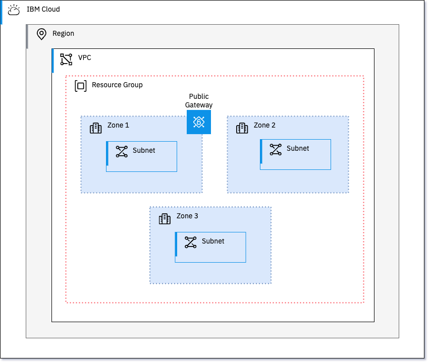

# Overview

This module deploys a VPC in IBM Cloud with the following characteristics:

- VPC with 3 zones
- Public gateways in any of the 3 zones based on the input
- Subnets in all 3 zones. If the zone has a public gagteway, the subnet will be attached to it
- Classic access enabled/disabled based on the input
- Can create an SSH key or use an existing one
- Can create a new resource group or use an existing one
- Ability to support custom address prefixes for the VPC

## Diagram



Things that have not been implemented yet, but I am working on:

- [ ] Ability to enable Flowlogs for a given VPC. This requires a cloud object storage instance as well as the buckets to store the logs. This also requires a service to service authorization between the 2 services. I have the logic in place, but I need to test it out.

## Get Started

### Prerequisites

- Terraform installed locally
- IBM Cloud API Key

### Steps

1. Clone the repository

```shell
git clone https://github.ibm.com/IBMCloudTech/ibmcloud-mzr-vpc.git
cd ibmcloud-mzr-vpc
```

2. Copy `terraform-tfvars-example` to `terraform.tfvars` and fill in the required values

```shell
cp terraform-tfvars-example terraform.tfvars
```

## Inputs

| Name | Description | Type | Default | Required |
|------|-------------|------|---------|:--------:|
| <a name="input_address_prefix"></a> [address\_prefix](#input\_address\_prefix) | The address prefix to use if address\_prefix\_management is set to manual. This will be split in to three prefixes, one for each zone. | `string` | `"172.16.0.0/16"` | no |
| <a name="input_classic_access"></a> [classic\_access](#input\_classic\_access) | Indicates if the VPC will have Classic Access. | `bool` | `false` | no |
| <a name="input_owner_tag"></a> [owner\_tag](#input\_owner\_tag) | The owner tag to assign to all resources. | `string` | n/a | yes |
| <a name="input_project_prefix"></a> [project\_prefix](#input\_project\_prefix) | Prefix to assign to all deployed resources. If not provided a random string will be generated. | `string` | `""` | no |
| <a name="input_region"></a> [region](#input\_region) | The IBM Cloud region where the VPC and related resources will be deployed. | `string` | `""` | no |
| <a name="input_resource_group_id"></a> [resource\_group\_id](#input\_resource\_group\_id) | The ID of the resource group to use for deployed resources. | `string` | `""` | no |
| <a name="input_tags"></a> [tags](#input\_tags) | Tags to assign to all resources. | `list(string)` | `[]` | no |
| <a name="input_use_custom_prefix"></a> [use\_custom\_prefix](#input\_use\_custom\_prefix) | Indicates if custom address prefixes will be used. | `bool` | `false` | no |
| <a name="input_use_public_gateways"></a> [use\_public\_gateways](#input\_use\_public\_gateways) | Create a public gateway in any of the three zones set to `true`. | <pre>object({<br>    zone-1 = optional(bool)<br>    zone-2 = optional(bool)<br>    zone-3 = optional(bool)<br>  })</pre> | <pre>{<br>  "zone-1": true,<br>  "zone-2": false,<br>  "zone-3": false<br>}</pre> | no |


3. Initialize the Terraform workspace

```shell
terraform init
```

4. Plan and apply the Terraform configuration

```shell
terraform plan -out "$(terraform workspace show).tfplan"

terraform apply "$(terraform workspace show).tfplan"
```

## Outputs

| Name | Description |
|------|-------------|
| <a name="output_default_network_acl_id"></a> [default\_network\_acl\_id](#output\_default\_network\_acl\_id) | ID of the Default Access Control List for the VPC |
| <a name="output_default_routing_table_id"></a> [default\_routing\_table\_id](#output\_default\_routing\_table\_id) | ID of the Default Routing Table for the VPC |
| <a name="output_default_security_group_crn"></a> [default\_security\_group\_crn](#output\_default\_security\_group\_crn) | Cloud Resource Name (CRN) of the Default Security Group for the VPC |
| <a name="output_default_security_group_id"></a> [default\_security\_group\_id](#output\_default\_security\_group\_id) | ID of the Default Security Group for the VPC |
| <a name="output_local_vpc_zones"></a> [local\_vpc\_zones](#output\_local\_vpc\_zones) | Public gateway zone mapping to actual IBM Cloud VPC zone names |
| <a name="output_vpc_address_prefix_ids"></a> [vpc\_address\_prefix\_ids](#output\_vpc\_address\_prefix\_ids) | IBM Cloud VPC Address Prefix IDs |
| <a name="output_vpc_crn"></a> [vpc\_crn](#output\_vpc\_crn) | Cloud Resource Name (CRN) of the IBM Cloud VPC |
| <a name="output_vpc_id"></a> [vpc\_id](#output\_vpc\_id) | ID of the IBM Cloud VPC |
| <a name="output_vpc_public_gateway_ids"></a> [vpc\_public\_gateway\_ids](#output\_vpc\_public\_gateway\_ids) | ID of the deployed VPC Public Gateways |
| <a name="output_vpc_subnet_ids"></a> [vpc\_subnet\_ids](#output\_vpc\_subnet\_ids) | ID of the deployed VPC Subnets |

## Example usage of the module

1) This example shows how to deploy a VPC with public gateways in zones 1 and 2. Additionally as no `project prefix` is provided, a random string will be generated.

```hcl
module "resource_group" {
  source                       = "terraform-ibm-modules/resource-group/ibm"
  version                      = "1.1.5"
  resource_group_name          = var.existing_resource_group == null ? "${var.prefix}-resource-group" : null
  existing_resource_group_name = var.existing_resource_group
}

module "default_vpc" {
  source                  = "git::https://github.com/cloud-design-dev/dts-mzr-vpc.git"
  existing_resource_group = module.resource_group.resource_group_id
  region                  = var.region
  owner_tag               = "supercooldev"
  use_public_gateways = {
    zone-1 = true
    zone-2 = true
    zone-3 = false
  }
}
```

2) This example shows how to deploy a VPC with custom address prefixes and a project prefix. Additionally, public gateways are not created in any of the zones. 

```hcl
module "custom_vpc" {
  source                  = "git::https://github.com/cloud-design-dev/dts-mzr-vpc.git"
  existing_resource_group = var.existing_resource_group
  region                  = var.region
  project_prefix          = "custom"
  owner_tag               = "supercooldev"
  use_custom_prefix       = true
  address_prefix          = "192.168.50.0/18"
  use_public_gateways = {
    zone-1 = false
    zone-2 = false
    zone-3 = false
  }
}
```